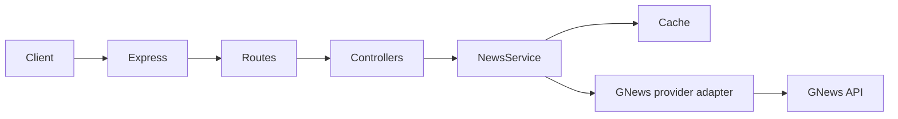
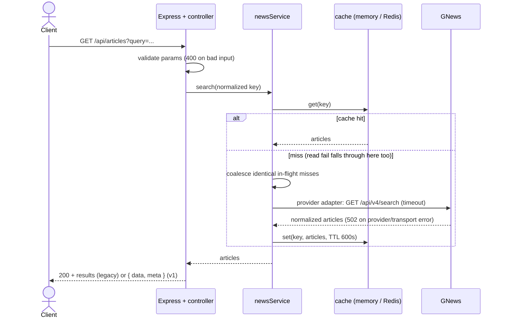
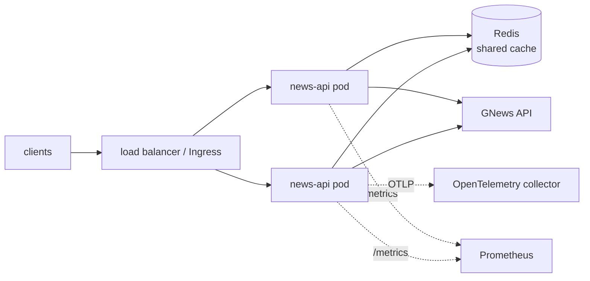

# Architecture

## Request flow

1. **Process** — `dotenv` loads first; **`otel-bootstrap`** starts OpenTelemetry when an OTLP endpoint (or `OTEL_TRACING_ENABLED=1`) is configured, before Express loads so HTTP is instrumented.
2. **Express** (`src/app.ts`) applies middleware in order: trust-proxy (optional), **Pino** request logging, **metrics** observer, **Helmet**, JSON body parser, **rate limiting** (skips `/health`, `/ready`, `/openapi.yaml`, `/metrics`), then mounts `/api` routes.
3. **Controllers** validate query parameters and map domain results to HTTP status codes.
4. **News service** builds cache keys from normalized search parameters (`query`, `count`, `lang`, `country`, `from`, `to`, `sortBy`), reads through `getCacheStore()` (in-memory or **Redis** when `REDIS_URL` is set), coalesces identical in-flight misses per process, and delegates upstream fetches to the GNews provider adapter. Cache backend errors are logged and metriced without failing the article request.
5. **Provider adapter** maps domain search options to GNews parameters, validates provider payloads, records upstream metrics, and opens a short circuit after repeated provider failures so outages are shed locally instead of amplified.
6. **Response mapping** keeps legacy `/api/articles*` endpoints backward compatible with raw arrays, while `/api/v1/*` returns `{ data, meta }` envelopes with `requestId`, normalized filters, and cache status.
7. **Title** and **source** endpoints reuse the search call, then narrow results in memory (exact title match; case-insensitive source name match).

### A search, end to end

The cache is an optimization, not a dependency: hits skip the provider, misses are
coalesced per process, and cache failures fall through to the upstream rather than failing
the request.

### Deployment shape

Liveness `/health` and readiness `/ready` back the probes in the example
[Kubernetes manifests](../deploy/k8s/); `REDIS_URL` switches the cache from per-pod memory
to the shared store drawn above.

## Configuration

- `dotenv` loads `.env` when `src/server.ts` starts (not required for Vitest, which sets `NODE_ENV=test` and mocks HTTP).
- `requireApiKeyUnlessTest` exits the process on startup if `GNEWS_API_KEY` is missing outside test mode.

## Errors

Unhandled promise rejections in async route handlers are forwarded by `asyncHandler` to Express. Legacy endpoints keep the original JSON `{ "error": "..." }` shape for compatibility. Versioned `/api/v1/*` endpoints return structured errors with stable machine-readable codes: `{ "error": { "code": "...", "message": "...", "requestId": "..." } }`.

## Caching

Article arrays are stored per normalized search key with a **600-second** TTL (`src/cache/store.ts`). Without `REDIS_URL`, `node-cache` is used; with `REDIS_URL`, **ioredis** stores JSON payloads for shared caches across replicas.

The service treats the cache as a quota and latency optimization, not as a hard dependency. Read failures fall through to the upstream provider, write failures return the upstream response without caching it, and both paths emit warning logs plus cache error metrics. Within a single process, concurrent misses for the same normalized key are coalesced so only the first request calls the provider.

## Provider Circuit Breaker

The GNews provider adapter tracks consecutive provider failures. After `UPSTREAM_CIRCUIT_FAILURE_THRESHOLD` failures, it opens a cooldown window (`UPSTREAM_CIRCUIT_COOLDOWN_MS`) and returns `503` without making another upstream call. After the cooldown, one request is allowed through; success closes the circuit, while another failure opens it again.

## Metrics

`src/metrics/register.ts` exports a single Prometheus registry used by `/metrics`. HTTP middleware records response counts, while `newsService` and the provider adapter record cache hits/misses/errors/coalesced misses, upstream request outcomes, upstream latency buckets, and circuit breaker events.
