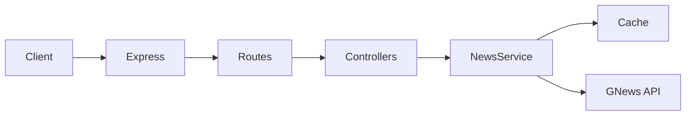

# Architecture

## Request flow

1. **Process** — `dotenv` loads first; **`otel-bootstrap`** starts OpenTelemetry when an OTLP endpoint (or `OTEL_TRACING_ENABLED=1`) is configured, before Express loads so HTTP is instrumented.
2. **Express** (`src/app.ts`) applies middleware in order: trust-proxy (optional), **Pino** request logging, **metrics** observer, **Helmet**, JSON body parser, **rate limiting** (skips `/health`, `/ready`, `/openapi.yaml`, `/metrics`), then mounts `/api` routes.
3. **Controllers** validate query parameters and map domain results to HTTP status codes.
4. **News service** builds cache keys from search query + `max`, reads through `getCacheStore()` (in-memory or **Redis** when `REDIS_URL` is set), otherwise calls GNews `/api/v4/search` via `axios`.
5. **Title** and **source** endpoints reuse the search call, then narrow results in memory (exact title match; case-insensitive source name match).

## Configuration

- `dotenv` loads `.env` when `src/server.ts` starts (not required for Vitest, which sets `NODE_ENV=test` and mocks HTTP).
- `requireApiKeyUnlessTest` exits the process on startup if `GNEWS_API_KEY` is missing outside test mode.

## Errors

Unhandled promise rejections in async route handlers are forwarded by `asyncHandler` to Express. `HttpError` instances become JSON `{ "error": "..." }` with the right status; other errors become `500` without leaking internals.

## Caching

Article arrays are stored per `query-count` key with a **600-second** TTL (`src/cache/store.ts`). Without `REDIS_URL`, `node-cache` is used; with `REDIS_URL`, **ioredis** stores JSON payloads for shared caches across replicas.
