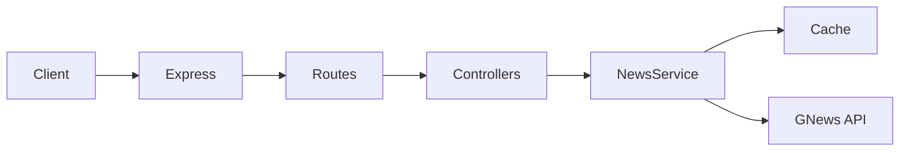

# Architecture

## Request flow

1. **Express** (`src/app.ts`) parses JSON bodies and mounts `/api` routes.
2. **Controllers** validate query parameters and map domain results to HTTP status codes.
3. **News service** builds cache keys from search query + `max`, returns cached arrays when present, otherwise calls GNews `/api/v4/search` via `axios`.
4. **Title** and **source** endpoints reuse the search call, then narrow results in memory (exact title match; case-insensitive source name match).

## Configuration

- `dotenv` loads `.env` when `src/server.ts` starts (not required for Vitest, which sets `NODE_ENV=test` and mocks HTTP).
- `requireApiKeyUnlessTest` exits the process on startup if `GNEWS_API_KEY` is missing outside test mode.

## Errors

Unhandled promise rejections in async route handlers are forwarded by `asyncHandler` to Express. `HttpError` instances become JSON `{ "error": "..." }` with the right status; other errors become `500` without leaking internals.

## Caching

`node-cache` stores article arrays per `query-count` key with a 600-second TTL (`src/utils/cache.ts`). Tuning TTL trades freshness for fewer upstream requests.
