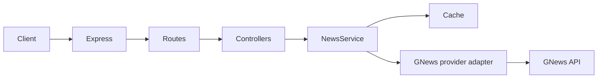
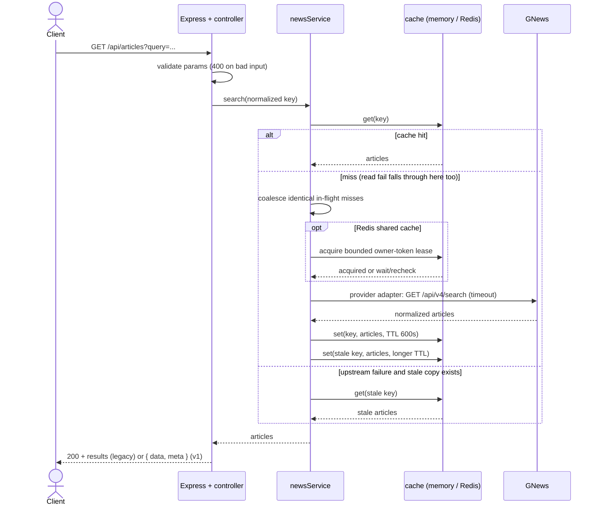
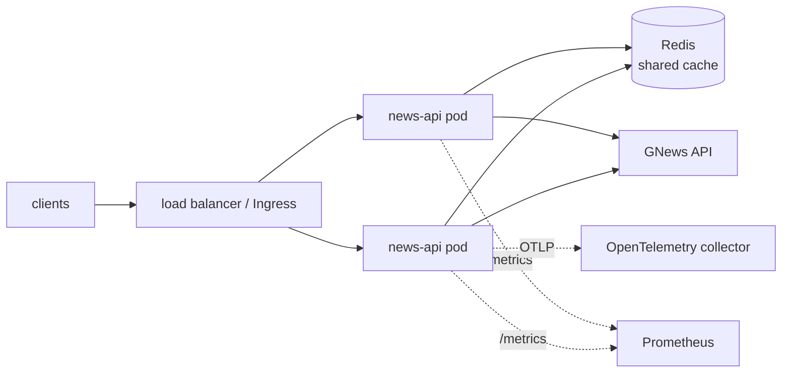

# Architecture

## Request flow

```mermaid
flowchart LR
  Client --> Express
  Express --> Routes
  Routes --> Controllers
  Controllers --> NewsService
  NewsService --> Cache
  NewsService --> Provider["GNews provider adapter"]
  Provider --> GNews["GNews API"]
```

1. **Process** — `dotenv` loads first; **`otel-bootstrap`** starts OpenTelemetry when an OTLP endpoint (or `OTEL_TRACING_ENABLED=1`) is configured, before Express loads so HTTP is instrumented. `src/server.ts` creates a Node `http.Server` with explicit request/header/keep-alive/socket-reuse limits before listening.
2. **Express** (`src/app.ts`) applies middleware in order: trust-proxy (optional), privacy-safe **Pino** request logging, **metrics** observer, **Helmet**, response compression for payloads at or above 1 KiB, strict JSON parsing with an explicit `SERVER_MAX_JSON_BODY_BYTES` limit, **rate limiting** (skips `/health`, `/ready`, `/openapi.yaml`, `/metrics`; uses shared Redis quotas when configured), then mounts `/api` routes.
3. **Controllers** validate query parameters, create a response-lifecycle abort signal, and map domain results to HTTP status codes.
4. **News service** builds cache keys from normalized search parameters (`query`, `count`, `page`, `lang`, `country`, `from`, `to`, `sortBy`), reads through `getCacheStore()` (in-memory or **Redis** when `REDIS_URL` is set), coalesces identical in-flight misses per process, and when Redis is active coordinates cold misses with a short owner-token lease plus a half-TTL heartbeat during slow loads. It tracks each caller as a subscriber and delegates upstream fetches to the GNews provider adapter. A disconnected subscriber stops awaiting the shared promise; the shared provider is aborted only when no subscribers remain. Cache and lease backend errors are logged and metriced without failing the article request.
5. **Provider adapter** composes the client signal with process shutdown and a cancelable total deadline, maps domain search options to GNews parameters, validates provider payloads, records upstream metrics, and opens a short circuit after repeated provider failures so outages are shed locally instead of amplified. Explicit cancellation is not retried, counted as a circuit failure, or served from stale fallback; total-budget exhaustion is a transient provider failure.
6. **Response mapping** keeps legacy `/api/articles*` endpoints backward compatible with raw arrays, while `/api/v1/*` returns `{ data, meta }` envelopes with `requestId`, normalized filters, `X-API-Version`, and search cache status in both metadata and headers. Provider `429` and `503` failures retain explicit public statuses and may include a normalized `Retry-After` header.
7. **Title** and **source** endpoints reuse the search call, then narrow results in memory (exact title match; case-insensitive source name match).

### A search, end to end

The cache is an optimization, not a dependency: hits skip the provider, misses are
coalesced per process, cache failures fall through to the upstream rather than failing
the request, and stale copies can serve reads when the provider fails.

```mermaid
sequenceDiagram
  actor Client
  participant API as Express + controller
  participant Svc as newsService
  participant Cache as cache (memory / Redis)
  participant GNews

  Client->>API: GET /api/articles?query=...
  API->>API: validate params (400 on bad input)
  API->>Svc: search(normalized key)
  Svc->>Cache: get(key)
  alt cache hit
    Cache-->>Svc: articles
  else miss (read fail falls through here too)
    Svc->>Svc: coalesce identical in-flight misses
    opt Redis shared cache
      Svc->>Cache: acquire bounded owner-token lease
      Cache-->>Svc: acquired or wait/recheck
    end
    Svc->>GNews: provider adapter: GET /api/v4/search (timeout)
    GNews-->>Svc: normalized articles
    Svc->>Cache: set(key, articles, TTL 600s)
    Svc->>Cache: set(stale key, articles, longer TTL)
  else upstream failure and stale copy exists
    Svc->>Cache: get(stale key)
    Cache-->>Svc: stale articles
  end
  Svc-->>API: articles
  API-->>Client: 200 + results (legacy) or { data, meta } (v1)
```

### Deployment shape

```mermaid
flowchart LR
  client["clients"] --> lb["load balancer / Ingress"]
  lb --> a1["news-api pod"]
  lb --> a2["news-api pod"]
  a1 --> redis[("Redis<br/>shared cache")]
  a2 --> redis
  a1 --> gnews["GNews API"]
  a2 --> gnews
  a1 -. /metrics .-> prom["Prometheus"]
  a2 -. /metrics .-> prom
  a1 -. OTLP .-> otel["OpenTelemetry collector"]
```

Liveness `/health` and readiness `/ready` back the probes in the example
[Kubernetes manifests](../deploy/k8s/); `REDIS_URL` switches the cache from per-pod memory
to the shared store drawn above.

## Configuration

- `dotenv` loads `.env` when `src/server.ts` starts (not required for Vitest, which sets `NODE_ENV=test` and mocks HTTP).
- `requireApiKeyUnlessTest` exits the process on startup if `GNEWS_API_KEY` is missing outside test mode.

## HTTP transport

The application server has explicit limits for incomplete requests, header/body size, and connection reuse:
`SERVER_HEADERS_TIMEOUT_MS` protects slow header delivery, `SERVER_REQUEST_TIMEOUT_MS` bounds
receipt of the complete request, `SERVER_MAX_HEADER_SIZE_BYTES` bounds incoming header bytes,
`SERVER_KEEP_ALIVE_TIMEOUT_MS` retires idle connections, and `SERVER_MAX_REQUESTS_PER_SOCKET`
limits connection reuse. These controls are separate from the provider's `UPSTREAM_TOTAL_TIMEOUT_MS`
and the graceful drain `SHUTDOWN_TIMEOUT_MS`; a reverse
proxy can use stricter values but should keep the budgets deliberate. The runtime HTTP adapter
also observes Node's `clientError` and `dropRequest` events before Express can see a request. It
uses fixed event labels, reproduces Node's 400/408/431/413 responses, and closes the socket after
handling a parser error so instrumentation does not weaken the default transport behavior. Warning
logs are rate-limited per event label by `SERVER_TRANSPORT_LOG_BURST` and
`SERVER_TRANSPORT_LOG_WINDOW_MS`; event counts remain complete and warning suppression is exposed
through `news_http_server_log_suppressed_total`. Express access logs use an allowlist of normalized
request ID, method, bounded pathname, response status, and response time; headers, query strings,
bodies, remote address/port, and arbitrary request objects are excluded.

Express's strict JSON parser uses `SERVER_MAX_JSON_BODY_BYTES` with a 32768-byte default and a
262144-byte maximum. It turns oversized entities into `413`, malformed JSON into `400`, and
unsupported encodings/charsets into `415`. The error handler returns fixed legacy or versioned
contracts, increments `news_http_body_errors_total{type=...}`, and logs only the fixed parser type
and status because parser errors may carry the failed body.

## Errors

Unhandled promise rejections in async route handlers are forwarded by `asyncHandler` to Express. Legacy endpoints keep the original JSON `{ "error": "..." }` shape for compatibility. Versioned `/api/v1/*` endpoints return structured errors with stable machine-readable codes: `{ "error": { "code": "...", "message": "...", "requestId": "..." } }`. Body-parser failures use `request_body_too_large` for `413` and `invalid_json_body` for `400`.

## Caching

Article arrays are stored per normalized search key with a **600-second** TTL (`src/cache/store.ts`). Without `REDIS_URL`, `node-cache` is used with a configurable `CACHE_MAX_KEYS` bound and least-recently-used eviction (default `2000`); with `REDIS_URL`, **ioredis** stores JSON payloads for shared caches across replicas and exposes the short lease capability used for cold-miss coordination.

The service treats the cache as a quota and latency optimization, not as a hard dependency. Read failures fall through to the upstream provider, write failures return the upstream response without caching it, and both paths emit warning logs plus cache error metrics. The Redis cache client bounds command and connection latency, retries each command at most once, and rejects commands while offline instead of queueing them through a reconnect; those failures use the same fail-open fallback. Malformed JSON and invalid article payloads are quarantined with best-effort deletion; deletion failures remain non-fatal and metriced. In-memory capacity is handled by evicting the least-recently-used entry, with eviction counts exposed as a metric. Within a single process, concurrent misses for the same normalized key are coalesced so only the first request calls the provider. Across Redis-backed replicas, a renewable bounded lease suppresses duplicate cold work when possible; unique owner tokens and compare-and-delete release prevent an expired owner from deleting a successor's lease, while renewal failure, expiry, or backend failure remains fail-open.

Responses at or above 1 KiB are compressed when the client advertises support. In a deployment with an ingress or reverse proxy, choose one compression owner to avoid double compression; the application default is useful for direct Node deployments and local demos.

Rate limits use the in-process store without `REDIS_URL`. With `REDIS_URL`, each process uses a
separate Redis connection and a namespaced `rate-limit-redis` store so replicas share quotas without
sharing cache lifecycle state. The rate-limit Redis client uses bounded command/connection budgets,
one request retry, and a bounded readiness gate before raw `sendCommand` calls. Store errors fail
closed with a structured `503`; IPv6 client keys
use the explicit `/56` subnet policy and trusted proxy behavior remains controlled by `TRUST_PROXY`.

Successful upstream searches write both a fresh cache key and a longer-lived stale key. The fresh key protects latency and quota under normal conditions; the stale key is only read after an upstream failure. Versioned responses expose this through `meta.cache=stale` and `X-Cache-Status: stale`.

## Provider Circuit Breaker

The GNews provider adapter tracks consecutive provider failures. After `UPSTREAM_CIRCUIT_FAILURE_THRESHOLD` failures, it opens a cooldown window (`UPSTREAM_CIRCUIT_COOLDOWN_MS`) and returns `503` without making another upstream call. After the cooldown, exactly one request is allowed through as the half-open recovery probe; concurrent callers remain short-circuited until that probe succeeds or fails. Success closes the circuit, while another failure opens it again.

## Tracing

Automatic OpenTelemetry HTTP/Express instrumentation provides request-level spans when an OTLP
exporter is configured. Manual domain spans add the useful application decisions beneath those
requests: `news.search`, `news.cache.lookup`, `news.cache.write`, `news.cache.stale_fallback`,
`news.upstream.circuit`, `news.upstream.request`, and `news.upstream.retry`. Span names and
attributes use bounded operation, state, outcome, provider, and retry values; query strings,
API keys, raw provider URLs, article content, and exception messages are intentionally excluded.

Tracing is optional and safe without a collector because the OpenTelemetry API uses no-op spans
until the SDK is enabled. Sampling remains an SDK/deployment decision; use the standard
`OTEL_TRACES_SAMPLER` and `OTEL_TRACES_SAMPLER_ARG` environment variables when a high-volume
deployment needs a lower trace rate. The deterministic exporter tests in `test/tracing.test.ts`
protect the span names, bounded attributes, and PII boundary.

## Metrics

`src/metrics/register.ts` exports a single Prometheus registry used by `/metrics`. HTTP middleware records response counts and body-parser failures, the runtime HTTP adapter records pre-Express transport events, while `newsService` and the provider adapter record cache hits/misses/errors/coalesced/stale misses, upstream request outcomes, upstream latency buckets, and circuit breaker events.
